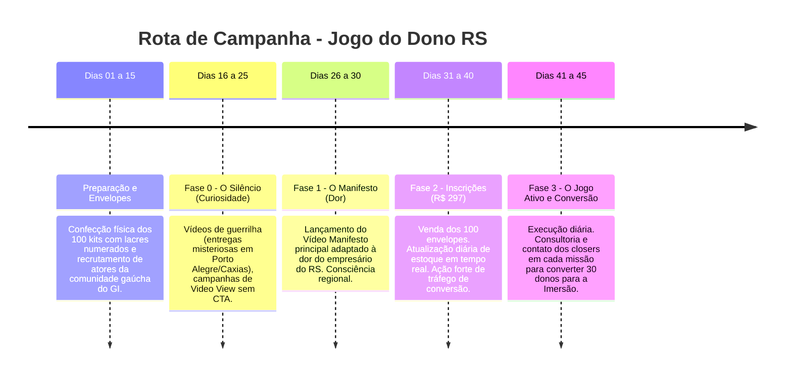

# Roadmap de Marketing — O Jogo do Dono (Campanha RS)

**Campanha:** O Chamado do Dono — A Prova de Fogo (Edição Rio Grande do Sul)
**Foco Geográfico:** Rio Grande do Sul (RS) — Cidades Polo: Porto Alegre/Canoas, Caxias do Sul/Bento Gonçalves, Vale dos Sinos (Novo Hamburgo/São Leopoldo), Passo Fundo e Santa Maria.
**Limite da Jornada:** Apenas 100 empresários participantes no estado.
**Meta de Conversão Final:** Converter 30 empresários para a Imersão Gestão de Impacto (GI) — Taxa de conversão de 30%.
**Preço do Jogo:** R$ 297.

---

## 1. Conceito Criativo e Estética da Campanha

A campanha é focada em **escassez física real e orgulho regional**. Não estamos vendendo um produto de massa. Estamos selecionando os 100 donos de empresas mais obstinados e maduros do Rio Grande do Sul para testarem a capacidade de crescimento de suas operações.

* **O Vetor Físico (Envelope Preto numerado):** Envelopes pretos foscos lacrados com cera âmbar/dourada contendo carimbos físicos em português com números de `JO-RS-001` a `JO-RS-100`.
* **Direção de Caracterização Física (RS):** As pessoas nos criativos e vídeos (atores da comunidade ou geradas por IA) devem ter traços comuns na população gaúcha de negócios: descendentes de alemães, italianos, portugueses e miscigenados do Sul. Rostos sérios, marcados pelo clima de negócios do Sul, vestindo roupas elegantes porém práticas para o clima gaúcho (suéteres, camisas neutras de alta gramatura, jaquetas de lã escura). Sem termos em inglês nas artes.

---

## 2. A Rota Gaúcha dos 45 Dias

---

## 3. Roteiros e Prompts para Inteligência Artificial (Sem Termos em Inglês)

### A. Geração de Vídeos (Gemini Omni - Google Veo/Imagen Video)

Os prompts abaixo contam com descrições detalhadas de movimento de câmera, iluminação, visual do Sul e ausência total de escrita em inglês.

#### 1. Entrega do Envelope Misterioso na Recepção (Porto Alegre)
> **Prompt:** A cinematic, high-paced 15-second vertical 9:16 video compilation for Seedance 2.0 showing a sequence of mysterious deliveries across different cities in Rio Grande do Sul. Camera and Style: High-quality cinematic anamorphic look, fast whip-pans and match cuts connecting different locations. Moody, high-contrast natural lighting, cool overcast daylight. The camera movements are energetic, snappy, and follow the action closely. The Messenger (The Courier): A mysterious, well-dressed Brazilian man, 35 years old, fit, clean-shaven with a sharp jawline. He is wearing a long black wool trench coat, dark sunglasses, and a black fedora hat (detective style). He moves swiftly, deliberately, and with agility, looking like he is evading surveillance or disappearing into the crowd. The Object (Tactical Envelope): A premium, rigid matte black paper envelope (A4 size). On the center, there is a round, glossy golden wax seal with an engraved key crest design. The number "JO-RS" is printed in subtle white mono-spaced font near the edge. The Courier holds the envelope firmly in his black leather-gloved hands. Chronological Sequence (15 Seconds, Multi-Scene): - Scene 1 (0:00-0:04) - The Street Delivery (Porto Alegre): Wide shot. The cold, cloudy street corner near Av. Carlos Gomes. The Courier in the long black coat walks fast past a pedestrian, swiftly slips the black envelope into the open hand of a businessman in a gray suit who is walking by, and continues walking without stopping. - Scene 2 (0:04-0:08) - The Office Drop (Caxias do Sul): Medium shot. Inside a contemporary minimalist corporate office with concrete walls. The Courier quickly slides the black envelope onto an empty desk near a glass window overlooking a misty, rainy mountain city skyline. The camera pans fast with the sliding envelope. - Scene 3 (0:08-0:11) - The Mailbox Slip (Residential Bento Gonçalves): Close-up shot. The black leather-gloved hand of the Courier quickly sliding the black envelope into the metal slot of a vintage dark-green house mailbox. An old brass nameplate next to it reads "FAMÍLIA". - Scene 4 (0:11-0:15) - Under the Door (Novo Hamburgo): Low-angle floor shot. Inside a dimly lit hallway. The black envelope is pushed swiftly and smoothly from the outside under a dark wooden office door. On the bottom corner of the envelope, a white printed text says "DIA 0 - ABERTURA" in Portuguese. No English words anywhere. High visual fidelity, realistic human movement, consistent lighting, and zero digital anomalies.

#### 2. Empresário Abrindo o Dossiê Físico (Serra Gaúcha)
> **Prompt:** A highly detailed, photo-realistic close-up vertical 9:16 video. Shot on 35mm lens, shallow depth of field, natural soft lighting coming from a side window, moody contrast. A 45-year-old Brazilian male business owner with typical southern Brazilian/Italian-descended features, slightly weathered skin, short graying beard, hair combed back. He is wearing a dark navy blue knitted wool sweater over a white collared shirt. He looks serious, focused, and slightly concerned. The camera is at a medium close-up angle, focusing on the businessman sitting at a dark wooden desk. His hands break open a dark red wax seal on a matte black envelope. He pulls out a high-quality paper document that has the header "DIA 1 – O COFRE" written in bold black Portuguese letters. He begins to read it, his eyebrows furrowing in concentration. Behind him, the background shows a modern but classic office with wooden shelves holding folders and a window displaying a slightly blurred view of a rainy, misty landscape typical of Caxias do Sul. No English text is visible. All text on the paper is in clear Portuguese.

---

### B. Geração de Imagens (Criativos Estáticos / Carrosséis - Midjourney / Imagen 3)

#### 1. Close-Up do Dossiê Físico do Jogo do Dono
> **Prompt:** A photo-realistic, high-end commercial photo of a tactical business dossier on a desk. Shot on a professional DSLR camera, 50mm lens, f/1.8 aperture for a shallow depth of field, warm dramatic side lighting, dark moody atmosphere. The focus is on a matte black heavy-paper envelope lying on a rustic dark oak office desk. The envelope has been opened, revealing high-quality off-white paper documents inside. A round dark-red wax seal with a stamp of a key icon is broken on the envelope. The paper document clearly displays the title "DIA 1 – O COFRE" printed in elegant, bold black capital letters. Below the title, there is a subtitle written in Portuguese: "Estanque os vazamentos financeiros do seu negócio." Next to the document, a high-quality matte black metal pen lies on the table. In the background, out of focus, we can see a glass of whiskey, a modern laptop keyboard, and the warm blur of office lights through a window on a cold night in Porto Alegre. Absolutely no English words. The text is sharp and in Portuguese. --ar 1:1 --style raw --v 6.0

#### 2. Retrato Realista do Empresário Gaúcho
> **Prompt:** A realistic portrait of a southern Brazilian entrepreneur. High-end portrait photography, natural window light highlighting one side of the face, dark gray textured background, sharp focus on eyes, shallow depth of field. A 48-year-old Brazilian man of Italian and German descent, typical of the Rio Grande do Sul region. He has short, neat, salt-and-pepper hair, a light stubble graying beard, and deep-set green-brown eyes. His expression is serious, pensive, and determined, conveying experience and the weight of responsibility. He is wearing a high-quality dark charcoal wool suéter over a light gray button-up shirt. He is sitting in a leather office chair, hands clasping together on his lap, looking slightly away from the camera. The setting is clean and professional. The image looks like it belongs in a business magazine. No exaggerated features, highly realistic skin texture. --ar 4:5 --style raw --v 6.0

#### 3. O Selo e Lacre Metálico "Expedição RS"
> **Prompt:** A macro close-up photograph of a luxury wax seal on a black document. Extreme close-up shot, macro lens, warm gold directional light highlighting the textures, dark dramatic shadows. A circular golden wax seal stamped onto a thick, premium textured black paper card. The wax has a dark gold, amber metallic sheen. The stamped design on the wax shows a geometric crest of a crown combined with a gear icon. Stamped around the circular edge of the golden wax, the text reads: "JOGO DO DONO — EXPEDIÇÃO RS" in clean, sharp, capital Portuguese letters. The texture of the black paper card and the slight overflow of the melted wax are highly visible and detailed. No English letters, no typos. --ar 16:9 --style raw --v 6.0

---

## 4. O Funil de Conversão de 30% (Closers + Dia 5)

Com a restrição de apenas 100 empresários participantes no jogo, a equipe de marketing e vendas precisa adotar uma postura de **alta personalização de contato (High Touch)**:

1. **Validação Ativa Diária:** O time comercial (closers) atua como "Analistas da Central de Controle do Jogo". Sempre que um empresário enviar a foto da evidência no app (por exemplo, os custos fixos no Dia 1 ou o organograma no Dia 3), o closer analisa a imagem e envia um feedback consultivo personalizado no WhatsApp em até 4 horas.
2. **A Alavanca do Dia 5 (A Caçada):** Essa missão comercial gera faturamento em 24h. O closer acompanha o resultado do Dia 5 e liga para o empresário: *"Você conseguiu aumentar seu caixa em R$ X.000 em um único dia aplicando a missão de forma isolada. A imersão Gestão de Impacto é onde vamos estruturar isso para acontecer de forma automática e recorrente todos os meses, sem depender de você apagar incêndio."*
3. **Mesa dos Donos (Bento Gonçalves / Porto Alegre):** O fechamento final da imersão (GI) é consolidado no almoço presencial oferecido como prêmio de conclusão para os participantes que entregarem as missões no prazo.
